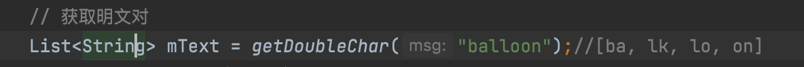

# infosec

### 基本介绍

* 加密/解密后可以在**src目录**找到对应的加密/解密文件
* 采用字节流的加密，支持各种类型的文件

* 编程语言
* JAVA
* 自测试平台
* macOS
* 开发工具
* idea

## 流加密算法


### 测试用例

* src中包含一个test.jpg文件和一个默认的密钥文件，可以用它来进行加密和解密
* 也可以使用指定的文件和密钥
* 指定文件直接使用项目自带的UI
* 指定密钥需要修改src目录下的key.txt文件
  
### 测试方法

* 运行项目（Main.java）

  

* 选择密钥

  

* 选择明文


* 加密文件（输出在src目录下**CText_ + 源文件名**)
	
	 加密后无法正常加载图片
	
	
	
* 解密文件（请选择src目录下**CText_ + 源文件名**）

  

* 在src目录下查看揭秘后的文件（**MText_ + 源文件名**）
	可以正常显示
  
  

## DES算法

### 模块说明

```java
// 密钥固定统计，返回一个记录了多次位数变化情况的整型链表
public static ArrayList<Integer> keyFix(byte[] des_key, byte[] des_input)
```

```java
// 明文固定统计，返回一个记录了多次位数变化情况的整型链表
public static ArrayList<Integer> msgFIx(byte[] des_key, byte[] des_input)
```

```java
// 统计单词改变位数之后的密文变化位数
public static int countChangeBits(byte[] des_cy, byte[] des_output)
```

```java
// 改变分组（第i字节中的第j位）
// 把64位的报文分组分成8个字节，通过生成两个随机数，i代表第i个字节，j代表该字节的第j位bit
public static void change(byte[] bytes, int i, int j)
```

```java
// 位了方便统计位数的变换情况，转为二进制且保留左边的0
public static String toBinary(int num, int digits)
```

```java
// des加密的核心算法，使用了java自带的密码模块 参照老师的example代码
private static byte[] des(byte[] des_key, byte[] des_input)
```

### 实验结果

* 测试用例：原生密文：F4 03 79 AB 9E 0E C5 33
* 每次迭代测试3000次
* 密钥固定结果：


* 明文固定结果


## playfair算法





## RSA算法

* 手工计算：在RSA系统中，一个给定用户的公开密钥是e=17，n=437，计算该用户的私钥，并对明文45加密。


* 程序使用上述用例，结果一致
	
	
## SSL抓包实验

* 没有使用SSL时候，可以看到用户密码都暴露在数据包中

	

* 使用SSL，可以看到数据都已经加密了

  
